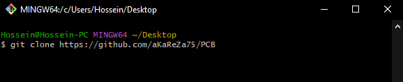
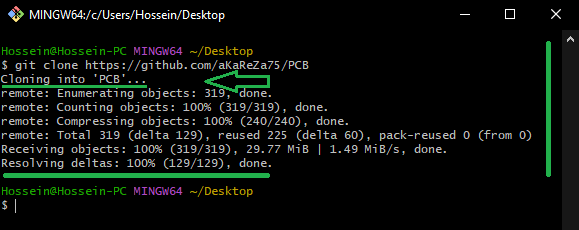

# PCB Design & Electronics  
This repository provides essential resources for **PCB design** and **electronics**, covering both theoretical concepts and practical applications.    
You'll find **tutorials, schematics, PCB layouts, and hands-on projects** to enhance your understanding.    Whether you're a beginner or an advanced user, these materials will help you design, analyze, and troubleshoot electronic circuits effectively. Be sure to check out the **educational boards** and **projects** for deeper insights!
> [!CAUTION]
> It is absolutely critical that you carefully read every single word of this document, line by line, to ensure you don't miss any details. Nothing can be overlooked.

# 🔗 Resources
   Here you will find a collection of useful links and documents related to PCB design and electronics. These resources include datasheets, tutorials, and essential tools to help you get started and guide you through the process.
  
> [!TIP]
> The resources are detailed in the sections below.  
> To access any of them, simply click on the corresponding blue link.

- [Video PlayList](./Videos.md)
  ---  
    All videos related to PCB design and electronics for this topic can be found at this link.

- [Projects](https://github.com/aKaReZa75#%EF%B8%8F-projects)  
  ---  
  I highly recommend exploring the **projects** available in this repository. They contain valuable insights and practical applications that will enhance your learning experience.  

- [Educational Boards](https://github.com/aKaReZa75#%EF%B8%8F-educational-boards)  
  ---  
  Be sure to check out the **educational boards**, where numerous key concepts and techniques have been demonstrated in detail.
    
- [PCB Raw Project (Altium Designer)](https://github.com/aKaReZa75/PCB_RawProject.git)  
  ---  
  This repository provides a **ready-to-use PCB project template for Altium Designer**, with pre-configured settings to help you kickstart your designs efficiently. Use this as a foundation to build and customize your own PCB projects without the hassle of setting up everything from scratch.

- [Design Templates (Schematics)](https://github.com/aKaReZa75/Design_Template.git)  
  ---  
  A collection of **pre-designed and tested schematics** that you can directly copy and integrate into your projects. Since these schematics have been verified, you can use them with confidence without worrying about design flaws, saving time and effort in your development process.

- [Altium Library](https://github.com/aKaReZa75/Altium-Library)  
  ---  
   All PCB designs across all repositories and projects are built using this Altium Designer component library. It contains a wide range of verified footprints, schematic symbols, and 3D models, ensuring consistency and accuracy in PCB designs. If you're working on a new PCB, using this library will save you time and minimize errors.

# 💻 How to Use Git and GitHub
To access the repository files and save them on your computer, there are two methods available:
1. **Using Git Bash and Cloning the Repository**
   - This method is more suitable for advanced users and those familiar with command-line tools.
   - By using this method, you can easily receive updates for the repository.

2. **Downloading the Repository as a ZIP file**
   - This method is simpler and suitable for users who are not comfortable with command-line tools.
   - Note that with this method, you will not automatically receive updates for the repository and will need to manually download any new updates.

## Clone using the URL.
First, open **Git Bash** :
-  Open the folder in **File Explorer** where you want the library to be stored.
-  **Right-click** inside the folder and select the option **"Open Git Bash here"** to open **Git Bash** in that directory.


> [!NOTE] 
> If you do not see the "Open Git Bash here" option, it means that Git is not installed on your system.  
> You can download and install Git from [this link](https://git-scm.com/downloads).  
> For a tutorial on how to install and use Git, check out [this video](https://youtu.be/BsykgHpmUt8).
  
-  Once **Git Bash** is open, run the following command to clone the repository:

 ```bash
git clone https://github.com/aKaReZa75/PCB
```
- You can copy the above command by either:
- Clicking on the **Copy** button on the right of the command.
- Or select the command text manually and press **Ctrl + C** to copy.
- To paste the command into your **Git Bash** terminal, use **Shift + Insert**.



- Then, press Enter to start the cloning operation and wait for the success message to appear.



> [!IMPORTANT]
> Please keep in mind that the numbers displayed in the image might vary when you perform the same actions.  
> This is because repositories are continuously being updated and expanded. Nevertheless, the overall process remains unchanged.

> [!NOTE]
> Advantage of Cloning the Repository:  
> - **Receiving Updates:** By cloning the repository, you can easily and automatically receive new updates.  
> - **Version Control:** Using Git allows you to track changes and revert to previous versions.  
> - **Team Collaboration:** If you are working on a project with a team, you can easily sync changes from team members and collaborate more efficiently.  

## Download Zip
If you prefer not to use Git Bash or the command line, you can download the repository directly from GitHub as a ZIP file.  
Follow these steps:  
1. Navigate to the GitHub repository page and Locate the Code button:
   - On the main page of the repository, you will see a green Code button near the top right corner.

2. Download the repository:
   - Click the Code button to open a dropdown menu.
   - Select Download ZIP from the menu.

    

3. Save the ZIP file:
   - Choose a location on your computer to save the ZIP file and click Save.

4. Extract the ZIP file:
   - Navigate to the folder where you saved the ZIP file.
   - Right-click on the ZIP file and select Extract All... (Windows) or use your preferred extraction tool.
   - Choose a destination folder and extract the contents.

5. Access the repository:
   - Once extracted, you can access the repository files in the destination folder.

> [!IMPORTANT]
> - No Updates: Keep in mind that downloading the repository as a ZIP file does not allow you to receive updates.    
>   If the repository is updated, you will need to download it again manually.  
> - Ease of Use: This method is simpler and suitable for users who are not comfortable with Git or command-line tools.

# 🤝 Contributing to the Repository
To contribute to this repository, please follow these steps:
1. **Fork the Repository**  
2. **Clone the Forked Repository**  
3. **Create a New Branch**  
4. **Make Your Changes**  
5. **Commit Your Changes**  
6. **Push Your Changes to Your Forked Repository**  
7. **Submit a Pull Request (PR)**  

> [!NOTE]
> Please ensure your pull request includes a clear description of the changes you’ve made.
> Once submitted, I will review your contribution and provide feedback if necessary.

# 🌟 Support Me
If you found this repository useful:
- Subscribe to my [YouTube Channel](https://www.youtube.com/@aKaReZa75).
- Share this repository with others.
- Give this repository and my other repositories a star.
- Follow my [GitHub account](https://github.com/aKaReZa75).

# 📜 License
This project is licensed under the GPL-3.0 License. This license grants you the freedom to use, modify, and distribute the project as long as you:
- Credit the original authors: Give proper attribution to the original creators.
- Disclose source code: If you distribute a modified version, you must make the source code available under the same GPL license.
- Maintain the same license: When you distribute derivative works, they must be licensed under the GPL-3.0 too.
- Feel free to use it in your projects, but make sure to comply with the terms of this license.
  
# ✉️ Contact Me
Feel free to reach out to me through any of the following platforms:
- 📧 [Email: aKaReZa75@gmail.com](mailto:aKaReZa75@gmail.com)
- 🎥 [YouTube: @aKaReZa75](https://www.youtube.com/@aKaReZa75)
- 💼 [LinkedIn: @akareza75](https://www.linkedin.com/in/akareza75)
