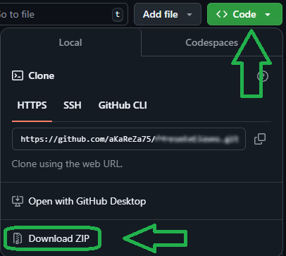

Printed Circuit Board
-------------
[](https://youtu.be/XcGx8F-Pwc0)
[](https://youtu.be/hTGrnCFe-TQ)
[](https://youtu.be/YPvdcqQbbiQ)
[](https://youtu.be/hNCFRN08QaA)
[](https://youtu.be/3z51BFROeN8)
[](https://youtu.be/BtFFsqzkCSk)
[](https://youtu.be/yqlKacCi0RM)
[](https://youtu.be/CHOmadm1B9U)
[](https://youtu.be/Cm22w3K2WrA)
[](https://youtu.be/eiynBFXXjeA)
[](https://youtu.be/GH5ICs1DhkY)
[](https://youtu.be/Ss4O40y-sWo)
[](https://youtu.be/yt6wmXNhPHg)
[](https://youtu.be/dTeTpMkixJI)
[](https://youtu.be/aoqMTQX8EtM)
[](https://youtu.be/wHq2v9WrjEQ)

# 💻 How to Use Git and GitHub
To access the repository files and save them on your computer, there are two methods available:
1. **Using Git Bash and Cloning the Repository**
   - This method is more suitable for advanced users and those familiar with command-line tools.
   - By using this method, you can easily receive updates for the repository.

2. **Downloading the Repository as a ZIP file**
   - This method is simpler and suitable for users who are not comfortable with command-line tools.
   - Note that with this method, you will not automatically receive updates for the repository and will need to manually download any new updates.

## Clone using the URL.
First, open **Git Bash** :
-  Open the folder in **File Explorer** where you want the library to be stored.
-  **Right-click** inside the folder and select the option **"Open Git Bash here"** to open **Git Bash** in that directory.


> [!NOTE] 
> If you do not see the "Open Git Bash here" option, it means that Git is not installed on your system.  
> You can download and install Git from [this link](https://git-scm.com/downloads).  
> For a tutorial on how to install and use Git, check out [this video](https://youtu.be/BsykgHpmUt8).
  
-  Once **Git Bash** is open, run the following command to clone the repository:

 ```bash
git clone https://github.com/aKaReZa75/PCB
```
- You can copy the above command by either:
- Clicking on the **Copy** button on the right of the command.
- Or select the command text manually and press **Ctrl + C** to copy.
- To paste the command into your **Git Bash** terminal, use **Shift + Insert**.


- Then, press Enter to start the cloning operation and wait for the success message to appear.


> [!IMPORTANT]
> Please keep in mind that the numbers displayed in the image might vary when you perform the same actions.  
> This is because repositories are continuously being updated and expanded. Nevertheless, the overall process remains unchanged.

> [!NOTE]
> Advantage of Cloning the Repository:  
> - **Receiving Updates:** By cloning the repository, you can easily and automatically receive new updates.  
> - **Version Control:** Using Git allows you to track changes and revert to previous versions.  
> - **Team Collaboration:** If you are working on a project with a team, you can easily sync changes from team members and collaborate more efficiently.  

## Download Zip
If you prefer not to use Git Bash or the command line, you can download the repository directly from GitHub as a ZIP file.  
Follow these steps:  
1. Navigate to the GitHub repository page and Locate the Code button:
   - On the main page of the repository, you will see a green Code button near the top right corner.

2. Download the repository:
   - Click the Code button to open a dropdown menu.
   - Select Download ZIP from the menu.

    

3. Save the ZIP file:
   - Choose a location on your computer to save the ZIP file and click Save.

4. Extract the ZIP file:
   - Navigate to the folder where you saved the ZIP file.
   - Right-click on the ZIP file and select Extract All... (Windows) or use your preferred extraction tool.
   - Choose a destination folder and extract the contents.

5. Access the repository:
   - Once extracted, you can access the repository files in the destination folder.

> [!IMPORTANT]
> - No Updates: Keep in mind that downloading the repository as a ZIP file does not allow you to receive updates.    
>   If the repository is updated, you will need to download it again manually.  
> - Ease of Use: This method is simpler and suitable for users who are not comfortable with Git or command-line tools.

# 🤝 Contributing to the Repository
To contribute to this repository, please follow these steps:
1. **Fork the Repository**  
2. **Clone the Forked Repository**  
3. **Create a New Branch**  
4. **Make Your Changes**  
5. **Commit Your Changes**  
6. **Push Your Changes to Your Forked Repository**  
7. **Submit a Pull Request (PR)**  

> [!NOTE]
> Please ensure your pull request includes a clear description of the changes you’ve made.
> Once submitted, I will review your contribution and provide feedback if necessary.

# 🌟 Support Me
If you found this repository useful:
- Subscribe to my [YouTube Channel](https://www.youtube.com/@aKaReZa75).
- Share this repository with others.
- Give this repository and my other repositories a star.
- Follow my [GitHub account](https://github.com/aKaReZa75).

# 📜 License
This project is licensed under the GPL-3.0 License. This license grants you the freedom to use, modify, and distribute the project as long as you:
- Credit the original authors: Give proper attribution to the original creators.
- Disclose source code: If you distribute a modified version, you must make the source code available under the same GPL license.
- Maintain the same license: When you distribute derivative works, they must be licensed under the GPL-3.0 too.
- Feel free to use it in your projects, but make sure to comply with the terms of this license.
  
# ✉️ Contact Me
Feel free to reach out to me through any of the following platforms:
- 📧 [Email: aKaReZa75@gmail.com](mailto:aKaReZa75@gmail.com)
- 🎥 [YouTube: @aKaReZa75](https://www.youtube.com/@aKaReZa75)
- 💼 [LinkedIn: @akareza75](https://www.linkedin.com/in/akareza75)
